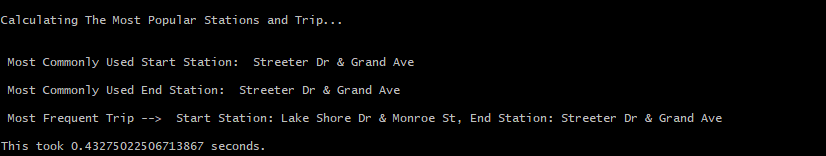
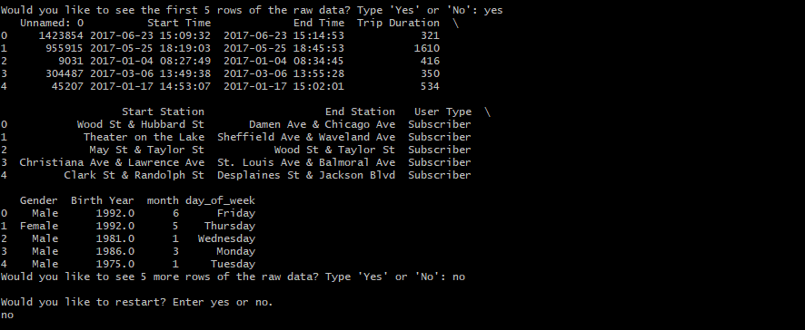

# Explore US Bikeshare Data In Python

## Project Overview

In this project, I used Python to explore data related to
bike share systems for three major cities in the United States:
Chicago, New York City, and Washington. The script imports the
data and answers interesting questions about it by computing descriptive
statistics. It takes in raw input from the user; to create an interactive experience in the terminal to present these statistics.

## Main Features:
* Imports the data from .csv Files
* Cleans the data set from 3 issues: NAN values, Duplicated Rows, and Incorrect Data types
* Calculates The Most Frequent Times of Travel
* Calculates The Most Popular Stations and Trip
* Calculates Mean Trips Duration
* Calculates User Stats
* Prints the rows of the raw data in the terminal based on the user's choice
* Saves the raw data after filtering on a specific day and month, in a new .csv file
* Prints general information about the data set
* Plots different types of graphs (Bar, Scatter, Pie) on the numerical variables in the data set, and saves them in a new folder

## What Software Did I Need?

To complete this project, I used the following software:

* Python
* A text editor: Atom
* A terminal application: Git Bash

## The Datasets

Randomly selected data for the first six months of 2017 are provided for
all three cities. All three of the data files contain the same core six (6) columns:

* Start Time (e.g., 2017-01-01 00:07:57)
* End Time (e.g., 2017-01-01 00:20:53)
* Trip Duration (in seconds - e.g., 776)
* Start Station (e.g., Broadway & Barry Ave)
* End Station (e.g., Sedgwick St & North Ave)
* User Type (Subscriber or Customer)

The Chicago and New York City files also have the following two columns:

* Gender
* Birth Year

## Statistics Computed

The code I wrote in this project computes a variety of descriptive statistics, and
provides the following answers:

### #1 Popular times of travel (i.e., occurs most often in the start time)

* most common month
* most common day of week
* most common hour of the day

### #2 Popular stations and trip

* most common start station
* most common end station
* most common trip from start to end (i.e., most frequent combination of start station and end station)

### #3 Trip duration

* total travel time
* average travel time

### #4 User info

* counts of each user type
* counts of each gender (only available for NYC and Chicago)
* earliest, most recent, most common year of birth (only available for NYC and Chicago)

## Screenshots

## Certification

This project was a milestone in my journey to study the Data Analysis Professional Nanodegree provided by Udacity.

## About The Author

* Author: Mohamed Abdel-Gawad Ibrahim
* Contact: muhammadabdelgawwad@gmail.com
* Phone: +201069052620 || +201147821232
